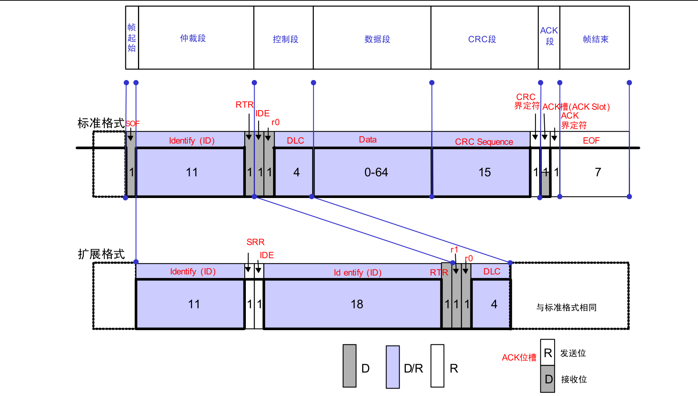

# Stm32

## 关于stm32f103c8t6最小系统板的学习

1. pwm输出
2. oled屏幕(spi协议)
3. 输入捕获
4. 串口
5. LCD液晶屏
6. Usmart----通过串口调试函数
7. ADC----通过串口输出adc1的通道1(PA1)采集到的电压转化的数字量
> stm32f103c8t6是中容量，没有dac
8. DS18B20----通过DS18B20读取温度，在串口中打印
9. DMA进行串口一发送
> 通过 dma把数据直接送到串口一的dr寄存器   
> 中文要gbk编码
10. iic协议，与24c02通信
> 使用Pc13 ---> SCL    
> 使用Pc14 ---> SDA           
> 注意24c0地址，是0xAE  

11. spi 0.96pled屏幕       

| 引脚 | 功能 | Remap  
| :---: | :---: | :---: |              
| PA4 | SPI1_NSS | PA15 |     
| PA5 | SPI1_SCK | PB3 |      
| PA6 | SPI1_MISO | PB4 |       
| PA7 | SPI1_MOSI | PB5 | 
| PB12 | SPI2_NSS | / |
| PB13 | SPI2_SCK | / | 
| PB14 | SPI2_MISO | / |
| PB15 | SPI2_MOSI | / | 

SPI屏幕接线           
D0(SCL)-->    PA5 | SPI1_SCK | PB3 |              
D1(sda) -->   PA7 | SPI1_MOSI | PB5 |        
CS      -->   PA4 | SPI1_NSS | PA15 |       
RES(复位,任选)   ---> PA3
DC(数据和命令选择)  ---> PA2          
初始化注意gpio 号

11. can通信
> 1. can通信的五种帧
* 数据帧---   标准格式(11位)和扩展格式(29位)&emsp;&emsp;&emsp;  发送单元----->接收单元
* 遥控帧(远程帧)---   标准格式(11位)和扩展格式(29位)&emsp;&emsp;&emsp;  接收单元(**向发送单元请求数据**)<-----具有相同 ID 的发送单元
* 错误帧---   错误时向其它单元通知错误的帧&emsp;&emsp;&emsp;&emsp;         错误----->  其他单元
* 过载帧---   接收单元通知其尚未做好接收准备的&emsp;&emsp;   接收单元没有做好准备----->其他单元
* 帧间隔---   数据帧及遥控帧与前面的帧分离开来的帧
> 数据帧      
> 数据帧由 7 个段构成。      
> 数据帧的构成如图 16 所示。      
> (1) 帧起始     
> 表示数据帧开始的段。  表示帧开始的段。1 个位的显性位。    
> (2) 仲裁段(**标准格式和扩展格式不同**)      
> 表示该帧优先级的段。   数据的优先级   
> (3) 控制段(**标准格式和扩展格式不同**)     
> 表示数据的字节数及保留位的段。    数据段的字节数   
> (4) 数据段    
> 数据的内容，可发送 0～8 个字节的数据。   包含 0～8 个字节的数据。从 MSB（最高位）开始输出     
> (5) CRC 段    
> 检查帧的传输错误的段。    检查帧传输错误,15 个位的 CRC 顺序 *1 和 1 个位的 CRC 界定符           
> (6) ACK 段   
> 表示确认正常接收的段。 确认是否正常接收, ACK 槽(ACK Slot)和 ACK 界定符 2 个位   
> (7) 帧结束
> 表示数据帧结束的段。     表示该该帧的结束,7 个位的隐性   

12. 红外遥控收发
> 复习系统时钟和各外设时钟